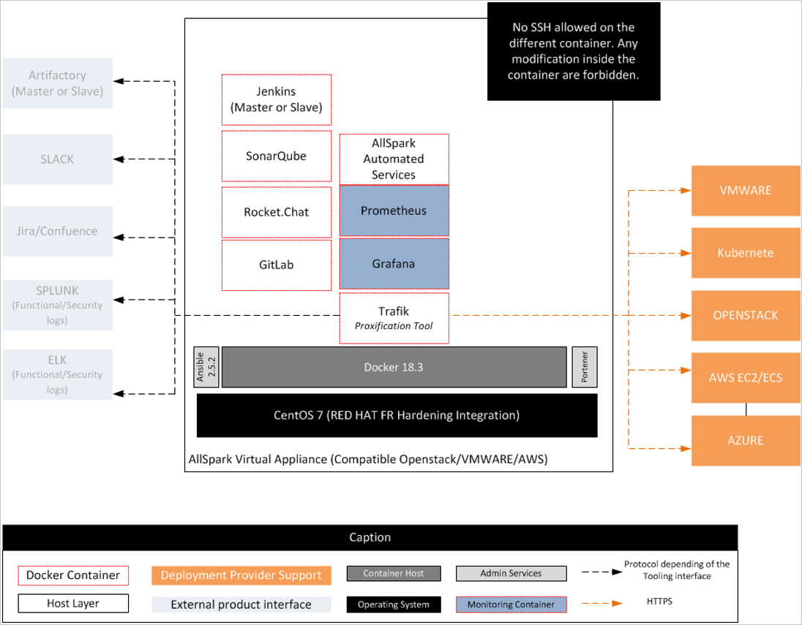

# Architecture

## Components

| Components    | Usage                             |
| ------------- | --------------------------------- |
| Gitlab        | Source code management            |
|               | Continuous integration / delivery |
|               | Work planning                     |
|               | Issue tracking                    |
| Portainer     | Container management              |
| RocketChat    | Instant chat (Slack like)         |
| Grafana       | Monitoring                        |
| Prometheus    | Metrics scraping / store          |
| CAdvisor      | Container metrics                 |
| Node exporter | System metrics                    |
| Sonarqube     | Continuous Inspection             |
| Traefik       | Dynamic reverse proxy             |

## Playbooks
- `release.yml`

> Package an Allspark release in a `.tar.gz` file

- `setup.yml`

> Load a packaged Allspark release into the system

- `install.yml`

> Install Allspark on the machine (either with an internet access or after using `setup.yml` playbook)
